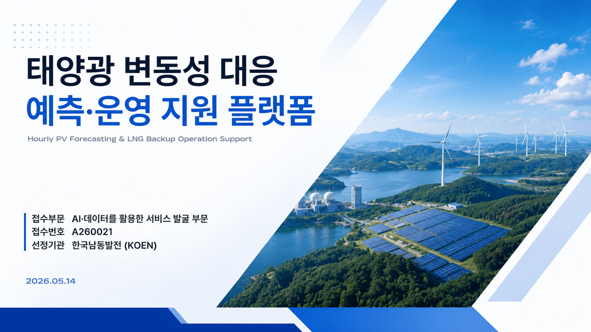
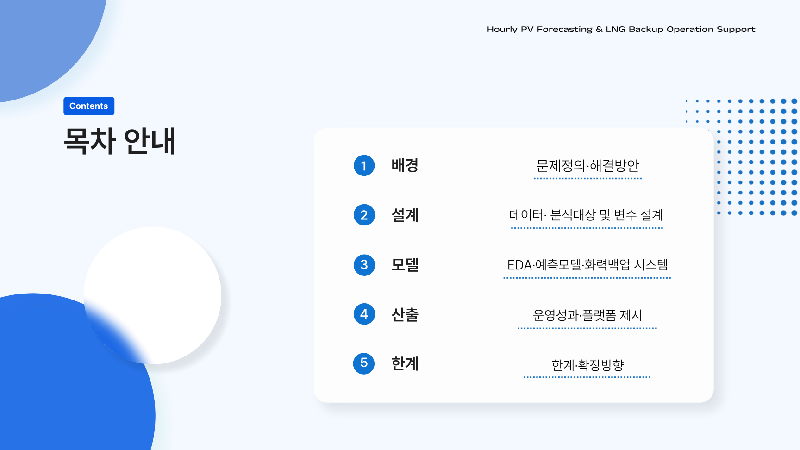
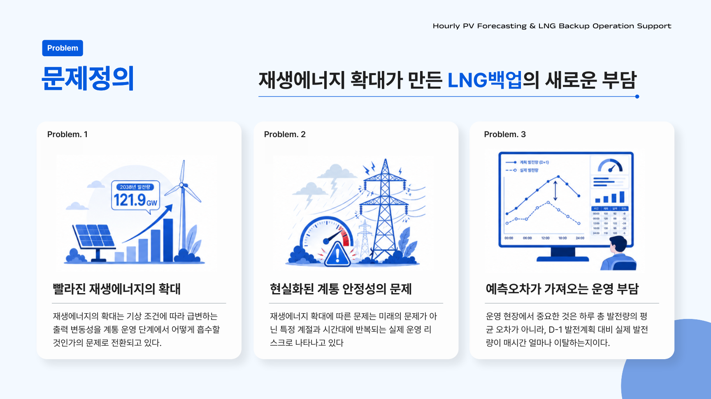
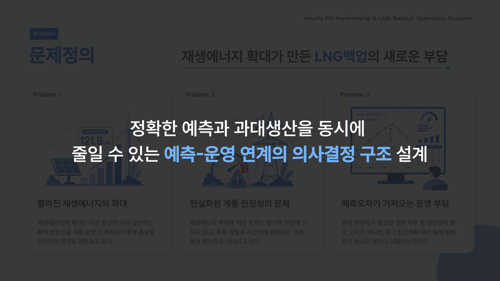

# 태양광 변동성 대비 LNG 백업 최적화 PoC

<p align="center">
  <b>🏆 진주시 빅데이터 공모전 — 한국남동발전 사장상 수상 🏆</b>
</p>

> 🥇 **진주시 빅데이터 공모전 남동발전사장상 수상작** ☀️⚡
>
> 한국남동발전(KOEN) 태양광 자체설비를 대상으로 발전량 예측 불확실성을 정량화하고, 분당 LNG 호기의 시간별 재배분을 추천하는 운영 지원 PoC. AI·공공데이터 활용 경진대회 산출물 **A260021**.

<p align="center">
  <a href="A260021발표자료.pdf">
    
    
  </a>
  <br/>
  <a href="A260021발표자료.pdf">
    
    
  </a>
</p>

<p align="center"><sub>전체 발표자료 (21페이지) — <a href="A260021발표자료.pdf"><b>A260021발표자료.pdf</b></a></sub></p>

---

## 1. 문제 정의

- 태양광은 변동비 0원 → 무조건 최대 발전, 전량 입찰. 따라서 진짜 문제는 **"내일·다음 1시간에 얼마나 나올지 모른다"**.
- 화력은 최소출력으로 24시간 가동 중 → 정확하지만 느림. 분당 LNG(10 호기, ~920MW) 만 PV 변동에 빠르게 대응 가능.
- 본 PoC의 책임 범위:
  1. **D-1 17:00** day-ahead baseline forecast (KPX 가용용량 신고 근거)
  2. **D-day 매 시각** intraday reforecast (다음 1~3h + 일몰까지)
  3. **호기별 LNG 재배분 추천** — 어느 호기를 얼만큼 ramp / warm-up 시킬지

자세한 정의: [`plan/active/main/problem.md`](plan/active/main/problem.md), [`plan/active/main/framing.md`](plan/active/main/framing.md)

---

## 2. 시스템 구조

```
[D-1 17:00]   Phase 1   : ResMLP + AdaLN ensemble (5-seed, frozen)
                          → day-ahead baseline μ_p1, σ_p1
                            (24h × 8 site, KPX 신고 근거)
                  ↓
[D-day t∈07~18] Phase 2 : 2-branch TCN, EOD truncation L=12
                          → t+1 ~ 일몰까지 reforecast μ_phase2
                          (Phase 1 frozen 위 residual + soft gate)
                  ↓
[D-day t]    Outage      : rule-based override (cf<0.03 + z<-3 + neighbor)
              Override     → mu_phase2 = 0 on blackout
                  ↓
[D-day t]    LNG Planner : Fleet allocator (10 LNG units)
              v4           - Layer A: instant_gap → online ramp (w ∝ Headroom × Ramp × Priority)
                           - Layer B: forward_gap → GT warm-up only (no output)
                           - DEADBAND=4MW (계통 1·2차 예비력 cushion)
```

핵심 산출물:
- Phase 1 / Phase 2 ensemble parquet → 호기별 capacity factor 분포
- Planner timeline → 호기별 dispatch 추천 + KPI (shortfall, over-commit, startup)
- Streamlit 대시보드 4-page (운영자 시점 운영 지원 UI)

자세한 spec: [`plan/active/pv/model_final.md`](plan/active/pv/model_final.md), [`plan/active/lng/plan.md`](plan/active/lng/plan.md)

---

## 3. 데이터

### 학습용 실측 (2022-01 ~ 2025-12, 48개월 hourly)

| 변수 | 소스 | 해상도 | 비고 |
|------|------|--------|------|
| PV 발전량 | KOEN 홈페이지 | 시간별·사이트별 | 11 사이트 (12 호기 중 ESS 왜곡 1개 제외) |
| LNG 발전량 | KOEN 홈페이지 | 시간별·호기별 | 분당 10 호기 (CS1~2, CG1~8) |
| GK-2A 위성 | 기상청 NCDC | 10분 (LCC 2km) → hourly 집계 | DSR/ASR/RSR |
| ASOS 지상기상 | KMA 11 관측소 | 시간별 | 기온/습도/풍속/강수/구름 |

데이터 SSOT: [`plan/active/main/data_strategy.md`](plan/active/main/data_strategy.md)

### Train / Val / Test split (target 시각 기준)

- **Train**: 2022-01 ~ 2023-12 (2년)
- **Val**: 2024-01 ~ 2024-12 (1년)
- **Test**: 2025-01 ~ 2025-12 (1년, out-of-sample)

### Perfect-foresight 한계

PV 모델 입력 weather는 *실제 D 시점 ASOS + GK-2A 관측값*. 따라서 측정 NMAE는 **PV mapping 함수의 upper-bound (모델 한계)**. 실제 D-1 17:00 NWP forecast 환경에선 NWP 오차가 추가되어 더 나쁨. 본 PoC 범위 안에서는 model 간 *상대 비교* 만 valid (framing 명시).

---

## 4. 성능 (test 2025)

### PV forecasting

| 단계 | Site NMAE | Portfolio NMAE | Cov80 | Cov95 |
|------|-----------|----------------|-------|-------|
| Phase 1 (ResMLP+AdaLN, 5-seed ensemble) | 5.12% | 4.75% | 82.6% / 85% | 94% |
| Phase 2 (2-branch TCN, L=12 EOD) | — | **4.43%** | — | — |
| **Phase 2 + Outage Override** | — | **4.22%** | — | — |

- Cloud-pass 03-23: 23 → **2.89%** (override 적용)
- Cloud-pass 04-26: 13.7 → **3.81%**
- 광양항 10/10-12 outage: 28.2 → **0.09%**

### LNG planner (daytime 09~17, 365일 portfolio)

| Variant | Shortfall (MWh) | Over-commit (MWh) | sign_flips |
|---------|-----------------|---------------------|------------|
| v2 baseline (CS2 single) | 4,527 | — | 58 |
| **v4 fleet + DEADBAND=4** | **442** | **640** | **0** |
| vs v2 | **−90.2%** | — | −100% |
| Phase 2 marginal | −19.1% | — | — |

자세한 변천 history: [`plan/active/lng/plan.md`](plan/active/lng/plan.md), [`plan/active/pv/proposal_outline.md`](plan/active/pv/proposal_outline.md)

---

## 5. 디렉토리 구조

```
pv_backup/
├── plan/active/                # 살아있는 계획 (versionless SSOT)
│   ├── main/  problem · framing · data_strategy
│   ├── pv/    model_final · dashboard_plan · proposal_outline
│   └── lng/   plan · parameter_reverse_engineering · (xlsx)
├── src/
│   ├── crawl/         GK-2A / KMA ASOS / KOEN 발전량 크롤러
│   ├── preprocess/    training set / thermal params / lng cost / gk2a hourly / D-1 archive
│   ├── models/
│   │   ├── train_resmlp_adaln_v2_ensemble.py   # Phase 1
│   │   └── train_phase2_2branch.py             # Phase 2
│   ├── forecast/
│   │   └── outage_override.py                  # rule-based blackout detection
│   ├── decisions/
│   │   ├── build_lng_baseline.py               # P_DA proxy = 2025 actual
│   │   ├── build_lng_unit_specs.py             # 10 LNG 호기 spec
│   │   └── thermal_planner_v4.py               # fleet allocator
│   └── dashboard/                              # Streamlit 4-page (한글 UI)
│       ├── app.py
│       ├── lib/data_loader.py
│       └── pages/  1_예측_비교  2_실시간_차이  3_호기별_백업  4_Phase2_가치
├── pv/
│   ├── experiments/                            # 학습/실험 산출물 (parquet, ckpt)
│   │   ├── resmlp_adaln_v2_ensemble/           # ★ Phase 1 production
│   │   ├── phase2_2branch_g20_L12/             # ★ Phase 2 production + override
│   │   └── thermal_planner_v4/                 # ★ planner output (dashboard 입력)
│   ├── eda_pv_model/                           # PV 모델 측 EDA + 의사결정 정리
│   ├── eda_lng_planner/                        # LNG planner 측 EDA + design 근거
│   └── notebooks/                              # EDA Jupyter
├── data/
│   ├── gk2a_v2/        시간 집계 + zenith CSV (★ 학습 입력)
│   ├── solar_hourly/   KOEN PV 발전량
│   ├── thermal_hourly/ KOEN LNG 발전량
│   ├── asos_hourly/    KMA 지상기상
│   └── processed/      training_set / lng_baseline / thermal_unit_profile
├── A260021발표자료.pdf  # 경진대회 발표자료
├── CLAUDE.md           # 프로젝트 컨텍스트 (AI 협업용)
└── README.md
```

---

## 6. 실행

### 환경 (uv)

```bash
uv sync
```

### 대시보드 (현재 production)

```bash
streamlit run src/dashboard/app.py
```

### Phase 1 / Phase 2 재학습

```bash
python src/models/train_resmlp_adaln_v2_ensemble.py   # 5-seed Phase 1
python src/models/train_phase2_2branch.py             # 2-branch TCN Phase 2
python src/forecast/outage_override.py                # blackout override 적용
```

### LNG planner

```bash
python src/decisions/build_lng_baseline.py            # P_DA + Avail proxy
python src/decisions/build_lng_unit_specs.py          # 10 LNG 호기 spec
python src/decisions/thermal_planner_v4.py            # fleet allocator
```

---

## 7. 참고

- 발표자료: [`A260021발표자료.pdf`](A260021발표자료.pdf)
- 모델 spec: [`plan/active/pv/model_final.md`](plan/active/pv/model_final.md)
- LNG planner spec: [`plan/active/lng/plan.md`](plan/active/lng/plan.md)
- 대시보드 spec: [`plan/active/pv/dashboard_plan.md`](plan/active/pv/dashboard_plan.md)
- 공모전 outline: [`plan/active/pv/proposal_outline.md`](plan/active/pv/proposal_outline.md)
- 외부 참고자료: [`references.md`](references.md)
